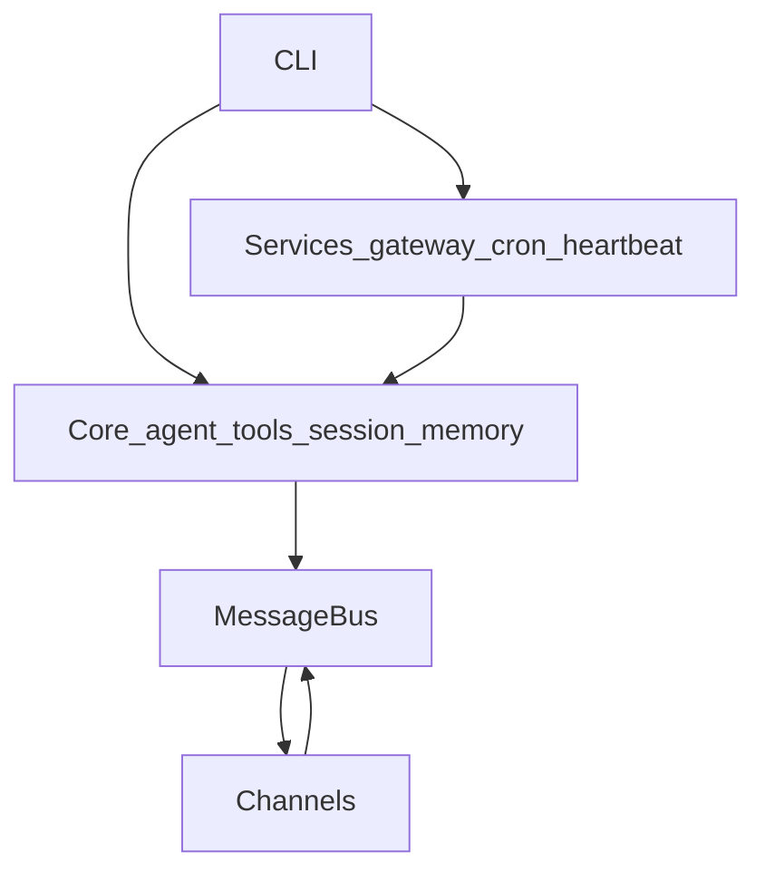

<p align="center">
  
</p>

# StormClaw

[](https://github.com/deepelement/stormclaw)
[](https://www.rust-lang.org/)

**Stormclaw** is a self-hostable, Rust-first personal AI assistant: an async **message bus**, pluggable **channels** (chat apps and email), **OpenAI-compatible** LLM providers, and a **CLI** plus long-running **gateway**, **cron**, and **heartbeat** services. It is built for operators who want an agent they can run on their own hardware, wire to the models they choose, and observe in production.


---

## Philosophy: open, performance, and security

### Open

- **GPL-3.0 license** and a **Cargo workspace** that separates concerns: `crates/core` (agent, bus, providers, session, memory, skills), `crates/channels`, `crates/services`, `crates/config`, `crates/utils`, and `cli`.
- **Provider-facing APIs** follow the OpenAI-compatible shape so you can point Stormclaw at hosted or self-hosted endpoints without lock-in to a single vendor.
- **Skills and tools** are first-class extension points; channel adapters share a common base so new surfaces can be added without rewiring the whole stack.

### Performance

- **Rust + Tokio** for async I/O and concurrency: the design targets always-on deployments where the gateway, channel workers, and scheduled jobs share the process efficiently.
- **Message-driven core**: inbound and outbound traffic flows through a **message bus**, which scales cleanly as you enable more channels or automate more workflows.
- We avoid marketing benchmarks; tune and measure on **your** hardware and workload if you need hard numbers.

### Security

- Rust’s **memory safety** and strict concurrency rules reduce whole classes of bugs that are expensive to catch in production.
- **Secrets** (API keys, bot tokens) belong in configuration and environment variables—never commit them, and avoid logging raw credentials.
- Self-hosting means **you** control network exposure: bind the gateway appropriately, use TLS at the edge, and restrict channel allow-lists (`allowFrom`, etc.) to the identities you trust.

---

## Features

| Area | What you get |
|------|----------------|
| Agent | Core loop, tools, subagent hooks, context building |
| Memory & session | Persistent session management and memory stores |
| Skills | Loadable skill modules integrated with the agent |
| Channels | Telegram, WhatsApp (bridge), Discord, Slack (HTTP + Socket Mode), Email (SMTP + IMAP) |
| Services | Gateway HTTP API, cron scheduler, heartbeat |
| CLI | `onboard`, `agent`, `gateway`, `channels`, `cron`, `config`, `session`, `status`, and more |
| Observability | Gateway `/health`, `/metrics` (Prometheus), structured logging via `tracing` |

---

## Quickstart

```bash
git clone https://github.com/deepelement/stormclaw.git
cd stormclaw

cargo build --release

./target/release/stormclaw onboard
# Edit ~/.stormclaw/config.json — set provider keys and channel tokens.

./target/release/stormclaw agent -m "Hello from Stormclaw"
./target/release/stormclaw gateway
```

Use `stormclaw --help` and subcommand help for the full command surface.

---

## Gateway HTTP API (overview)

| Endpoint | Method | Description |
|----------|--------|-------------|
| `/health` | GET | Liveness |
| `/status` | GET | Service status |
| `/sessions` | GET | List sessions |
| `/sessions/{id}` | GET | Session detail |
| `/sessions/{id}/clear` | POST | Clear session |
| `/channels` | GET | Channel status |
| `/channels/{name}/start` | POST | Start channel |
| `/channels/{name}/stop` | POST | Stop channel |
| `/cron/jobs` | GET | List scheduled jobs |
| `/heartbeat/trigger` | POST | Trigger heartbeat |
| `/metrics` | GET | Prometheus metrics |

---

## Architecture

Stormclaw is layered:

1. **CLI** dispatches commands and can run the agent or start services.
2. **Services** (`gateway`, `cron`, `heartbeat`, lifecycle) orchestrate long-running behavior.
3. **Core** implements the **agent loop**, **tool registry**, **sessions**, **memory**, **skills**, and **LLM providers**.
4. **Message bus** moves **inbound** and **outbound** events between core logic and adapters.
5. **Channels** connect Telegram, Discord, Slack, email, and other surfaces to that bus.



For a deeper walkthrough, see [ARCHITECTURE.md](ARCHITECTURE.md) and [RUST_ARCHITECTURE.md](RUST_ARCHITECTURE.md).

---

## Development and testing

```bash
cargo test --workspace
cargo test -p stormclaw-integration-tests
```

Integration and smoke coverage includes config round-trips, cron persistence, message bus flows, CLI help, agent short paths with a mock LLM, and gateway `/health` / `/metrics` checks. See [tests/README.md](tests/README.md) for layout notes.

### CI in a monorepo

If this tree lives under a parent repository as `stormclaw/`, use a workflow with `working-directory: stormclaw` (for example `.github/workflows/stormclaw-ci.yml` at the monorepo root). If **this** directory is the Git root, add an equivalent workflow at `.github/workflows/` **without** that `working-directory` override so `cargo test --workspace` runs from the repo root.

---

## Security disclosures

If you believe you have found a security vulnerability, please open a **private** report via [GitHub Security Advisories](https://github.com/deepelement/stormclaw/security/advisories/new) for this repository, or file a confidential issue according to your organization’s process. Do not post exploit details in public issues.

---

## Contributing

Pull requests are welcome. Run `cargo test --workspace` before submitting, describe the behavior change, and note any config or channel impact. For detailed Chinese-language docs and channel setup examples, see [README_RUST.md](README_RUST.md).

---

## License

This project is licensed under the **GPL-3.0** license; see the `license` field in [Cargo.toml](Cargo.toml).
